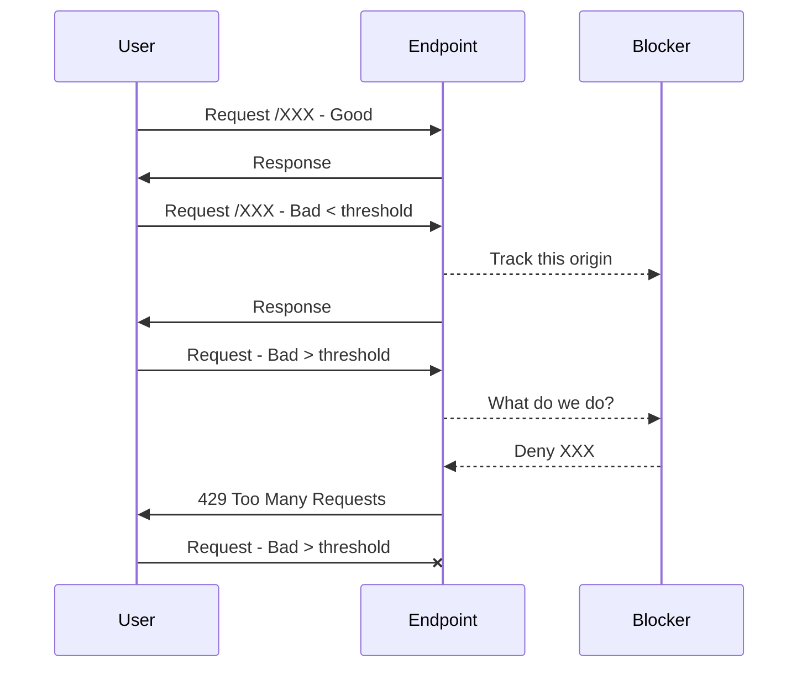

# my little SRE Sandbox #1
***Please note:** this is not a PRD-ready implementation... A just-for-giggles prototype if you will.
Read the story - it will make better sense...*
## TL:DR
While doing a log parsing *exercise*, I figured I'd expand on a more practical use-case and built a **Request Filter / Blocker** - that uses rules to block all traffic from an offending IP to a set URL after a set number of failures.
Implemented on a Controller-level and as a Middleware and using In-Memory DB via EF6.

# Use-case:
To block malformed or unsafe traffic to a monitored endpoint using rules, e.g. you have a DoS or a broken client sending bad requests and don't want them to drag you down from performance or security perspective.
Rules define: endpoints matching and blocking patterns and request methods to watch and block. 

**Logic:**
 - If a request to a specific path fails, start tracking requests from that origin (single IP)
 - Keep counting failures requests from the same origin until a threshold is reached 
 - When above threshold in a time bucket, block traffic from that origin to the path
	 - Return `429 Too Many Requests` with `X-Rate-Limit` headers
	 - When the time bucket expires, reset/clear the tracking

It can be applied at the API Controller level and would be cool but not very practical in terms of maintenance and code expansion, though can be used on a one-off basis I suppose.
A better approach would be to use it as a Middleware for the entire site. OR better yet, implement as reverse-proxy, which would scale much better in a farm. 
## What's where / contents
 - **Controllers**
 	 - `/Test`
	    - `ResponderTestController.cs` - a `test API` that allows you to get response with a controlled status; implements    FailedRequestBlocker on the Controller-level - cool but not very practical at scale, though can be used on a one-off basis I suppose
	 - `/FailedRequestBlocker`
		 - `FailedRequestRulesDBController.cs` - manage blocking rules
		 - `FailedRequestLogDBController.cs` - manage filter records
		 - `FailedRequestCleanupServiceController.cs` - manage the cleanup service
	 - `/LogParser`
		 - `apacheLogParserAsyncController.cs` - a more practical for implementation of simple log parser 
   		 - `apacheLogParserController.cs` - same but sync
  - **Middleware**
	  - `FailedRequestBlockerMiddleware.cs` - primary filter as a m/w implementation, i.e. meat and potatoes of this repo 
   	 - `FailedRequestLoggingContext.cs` - DB context for tracking records and rules
   	 - `CleanupService.cs` - stale tracking record cleanup background service
   	 - `RequestLoggingMiddleware.cs` - a test HTTP logger middleware
## 0. apacheLogParserCLI 
This is where it started... 
A simple access log parser, but was actually fun to write in Python and C#
 - parse sample log regex, aggregate in a few different ways
 - ... then find **unsafe** POST by time bucket, i.e. above threshold per bucket size
## 1. sreSandbox / Controllers / LogParser
A simple access log parser (read the story), but was actually fun to write.
 - parse sample log regex, aggregate in a few different ways
 - ... then find **unsafe** POST by time bucket, i.e. above threshold per bucket size
## 2. sreSandbox - / Controllers (other) & /Middleware

### Rules
Multiple Rules can be layered and fine tuned.
 
**Example:**
IF any `5` of `POST, PATCH, PUT or DELETE` requests to `regex:/api/responder/respond/as/.*` from the same IP fail within `3 minutes`
THEN deny access to `/api/responder/respond/as/` to `ALL` traffic from that IP for  `3 minutes`
THEN keep blocking until no requests have been blocked in the last `3 minutes` 
THEN keep checking traffic from the origin until `5 minutes` elapsed with no recurrence 
THEN after `5 minutes` forget what happened 

```json
{
    "id": 1,
    "name": "Default Rule - MW",
    "threshold": 5,
    "ip": [],
    "methodsMatch": [
      "POST",
      "PATCH",
      "PUT",
      "DELETE",
      "UNKNOWN"
    ],
    "methodsBlock": [
      "ALL"
    ],
    "pathMatch": [
      "regex:/api/responder/respond/as/.*"
    ],
    "pathBlock": "/api/responder/respond/as/",
    "status": [
      400,
      401,
      402,
      403,
      404,
...
      599
    ],
    "period": "00:03:00",
    "forgetAfter": "00:05:00",
    "responseStatus": 429,
    "responseMessage": "Too Many Requests within the 1m period."
  }
]
```

# The Story 
*- feel free to skip to the meat and potatoes* 
I had an interesting experience at an interview not long ago. Btw, it was the first ever coding test that was actually in any shape or form _relevant_ to the type of job it was for.
I flopped it though... Not sure if it was the actual requirement of the job or a limitation of test platform setup - as I understood it, the test was available in Java, Ruby or Python, with an implication that at least one of the questions will be in Python. 
My go-to is **C#** and I could not get a clarification from the recruiter, so I figured if Python is a must, I'd better brush up on it a bit and try the test as embarrassing as it may be. 

**The task** was to progressively write a series of variations on **Apache Access Log** parser:
 1. Count successful POST
 2. Aggregate successful POST size by path
 3. Aggregate failed POST by file *(I think?)*
 4.   Aggregate failed POST by Time Bucket *(I think? or something similar)*

The premise is well-founded, though I would go about it via telemetry / observability rather than sifting through logs manually. OK, so I built it in Python. Had some fun with Pandas :) Then for giggles did it net core just to make a point.
Well, why stop there, right? 
From the practical standpoint, why would you want to parse individual logs? It makes more sense to have an API you can integrate in a process. And so I ported the CLI project to an API. So far so good.

In reality, you would be forwarding the logs to an aggregator (Elastic/Prometheus/DataDog/< your fave here>), then using alerting and remedial action hooks. 
Or in most cases you would be using WAF or Reverse Proxy with security features to safeguard yourself form an attack / bad traffic and alerting on the incidence of the blocking event.
So why not write a little `FailedRequestBlocker`, right? 
When more then `N` `Barbarians` are the `(application-) Gate` per `timeframe`, slam them gates shut and tell archers to start slinging arrows (throws an *`ArcherNotImplemented`* exception for now).
So I built a `Middleware` flavour for the whole App to use and added it to `ResponderTestController.cs` as a localised flavour.     
This was fun. I decided to share it in case someone may find it useful. 
